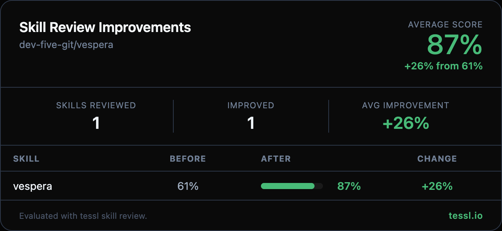

Hey @owjs3901 👋

I ran your skills through `tessl skill review` at work and found some targeted improvements. Here's the full before/after:

| Skill | Before | After | Change |
|-------|--------|-------|--------|
| vespera | 61% | 87% | +26% |

Changes made

**Description (40% → 100%)**
- Expanded frontmatter description with concrete actions (define route handlers, derive schemas, auto-generate OpenAPI docs)
- Added explicit "Use when..." clause for skill selection
- Added broader trigger terms (REST API, HTTP endpoints, Swagger, ReDoc, SeaORM, multipart)

**Content (65% → 70%)**
- Added end-to-end workflow section (model → schema_type → handler → annotate → build → validate)
- Added validation checkpoint after Quick Start using `swagger-cli validate`
- Removed redundant "Same-File Model Reference" section (already covered in parameters table and Quick Reference)
- Removed redundant "Complete Example" section (patterns already demonstrated in Quick Start and Basic Syntax)
- Removed "Why Not Manual Structs?" section and DO/DON'T table (overlaps with Quick Reference examples)
- Consolidated three parameter tables into one unified table with Priority column

Honest disclosure — I work at @tesslio where we build tooling around skills like these. Not a pitch - just saw room for improvement and wanted to contribute.

Want to self-improve your skills? Just point your agent (Claude Code, Codex, etc.) at [this Tessl guide](https://docs.tessl.io/evaluate/optimize-a-skill-using-best-practices) and ask it to optimize your skill. Ping me - [@yogesh-tessl](https://github.com/yogesh-tessl) - if you hit any snags.

Thanks in advance 🙏
